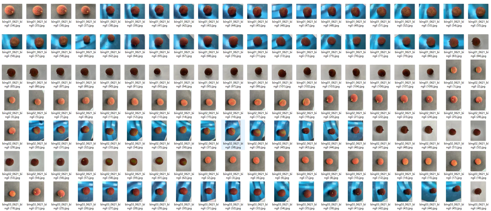
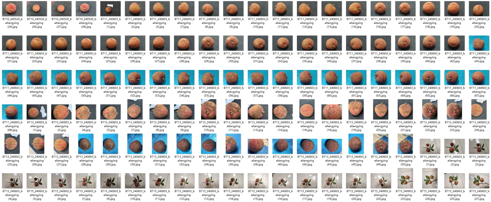
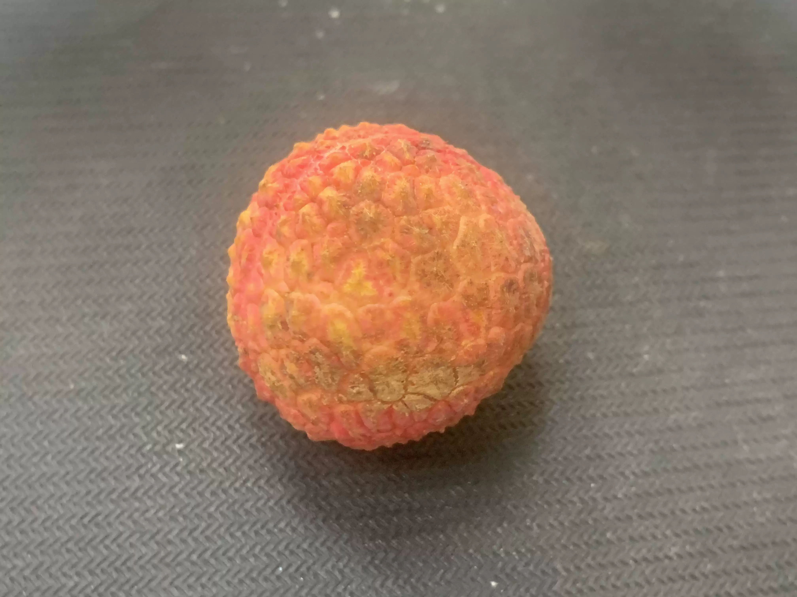
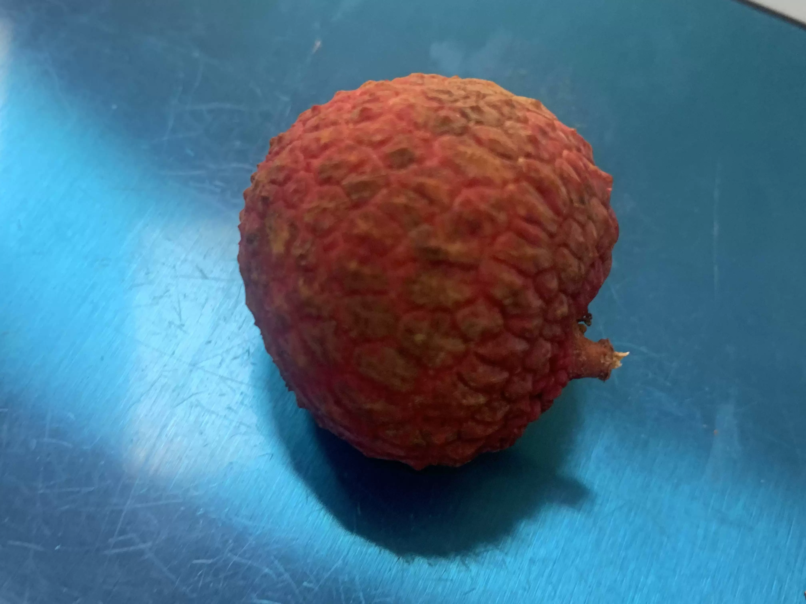
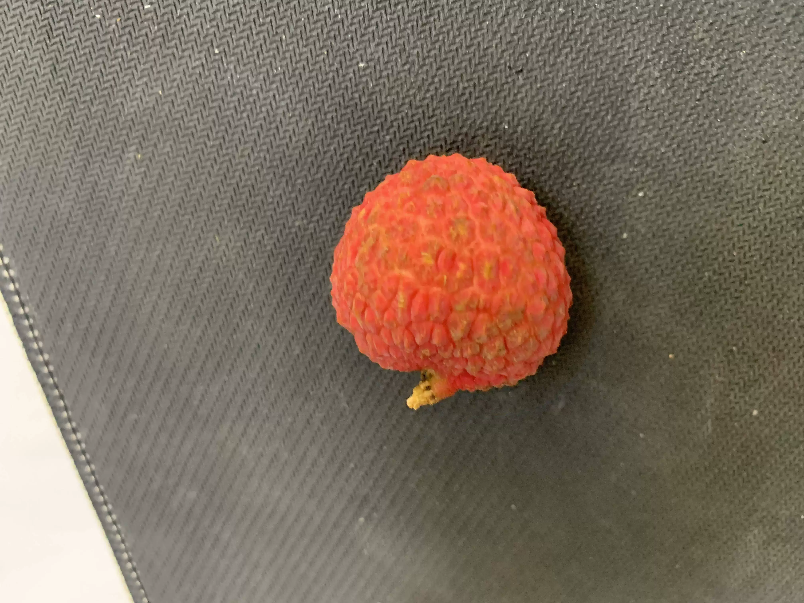
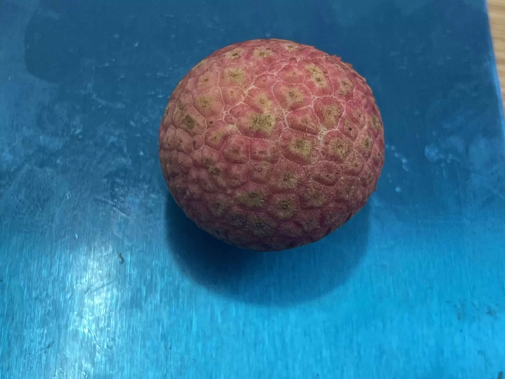
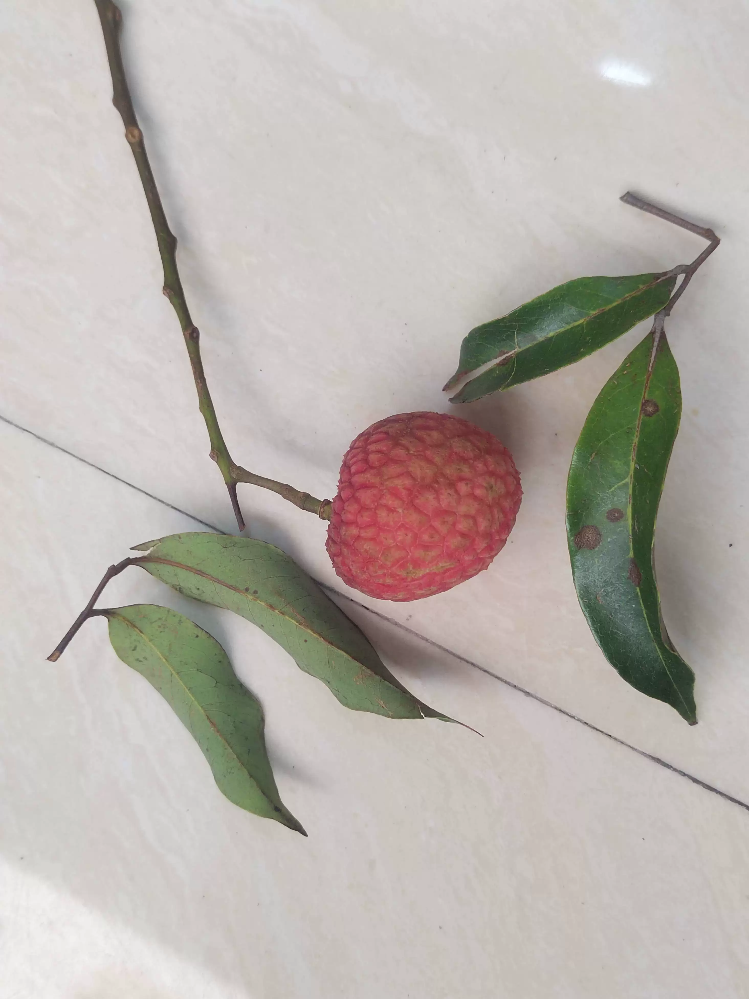
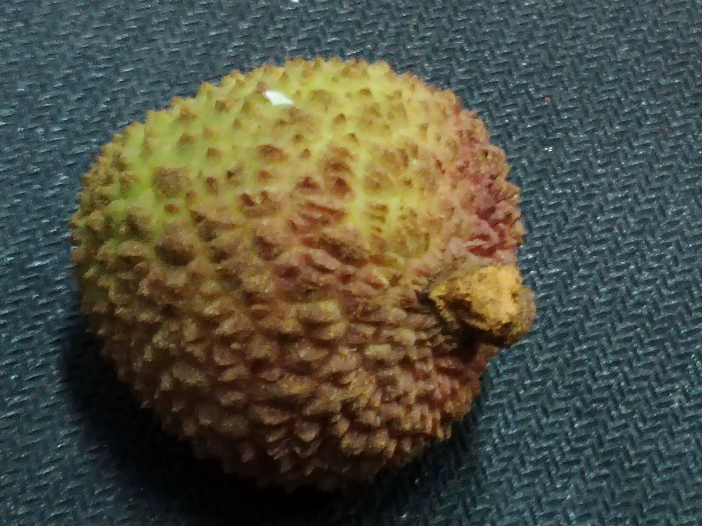

## Body

（Agricultural Product）Litchi Variety Identification Dataset in YOLO format

This dataset contains 11,998 raw images, covering 12 varieties of litchi. All images are original and unprocessed, without data expansion, enhancement, or any other manipulations.

English Varieties: Osmanthus-Fragr Litchi; Glu-Rice Ciba Litchi; Trib-Royal Litchi; Chk-Beak Litchi; Icy-Flesh Litchi; Wax-Shiny Leaf Litchi; Grn-Circle Litchi; Mar-Orange Litchi; Honey-Jar Litchi; Concubine-Smile Litchi; Blk-Green Leaf Litchi; Sci-Cultivar No.1
Chinese Varieties: Osmanthus-Fragr Litchi; Fumi Ciba Litchi; Trib-Royal Litchi; Chibi Litchi; Ice-Flesh Litchi; Wax-Shiny Leaf Litchi; Gan-Circle Litchi; Mar-Orange Litchi; Honey-Jar Litchi; Concubine-Smile Litchi; Black-Leaf Litchi; Sci-Cultivar No.1

The raw images were collected in Maoming City, Guangdong Province, China. The backgrounds are white, blue, or black.

Train: 8,199 raw images + labels (68.33%)
Valid: 2,330 raw images + labels (19.42%)
Test: 1,469 raw images + labels (12.25%)
Total: 11,998 images (Due to rounding, there is a slight deviation from 12,000 images) - 41.21GB

Electronic virtual products sold are non-refundable.

## Images

Here is a pay link on Stripe ( https://buy.stripe.com/3cs8yP7sY87d0vu9AB ). Please contact me lonlonago@foxmail.com after funding $89, and I will send you a complete data files , thank you!

